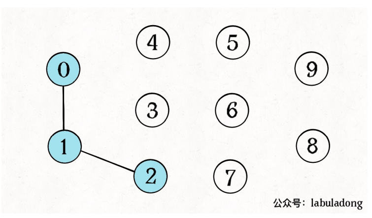
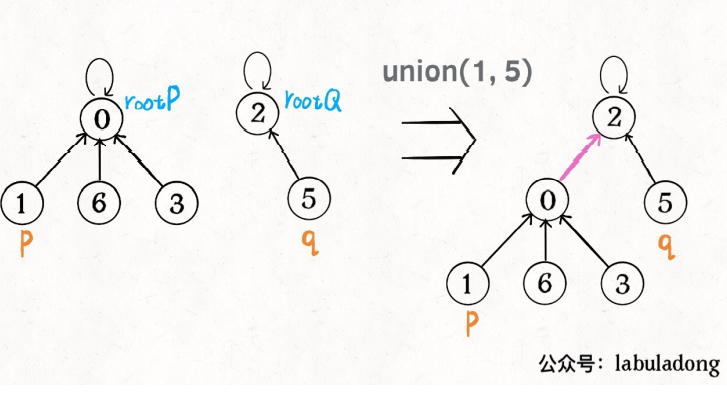
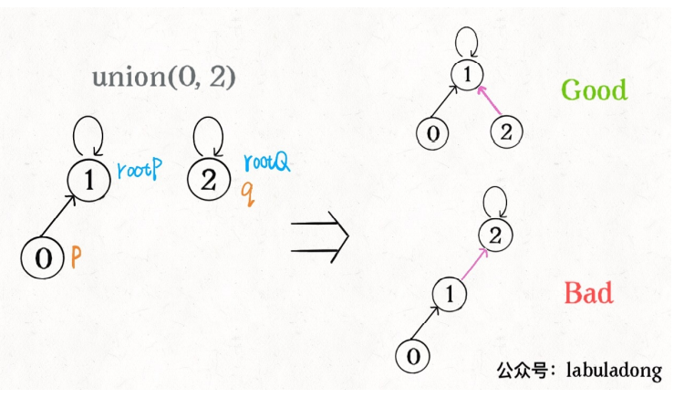
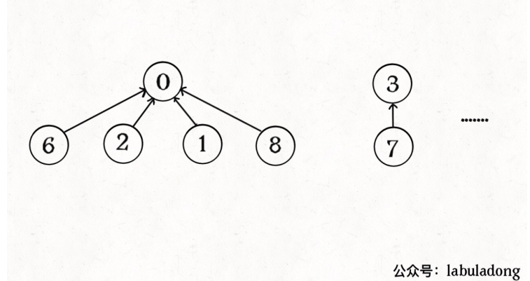

# 题目列表

[除法求值](https://leetcode-cn.com/problems/evaluate-division)

[省份数量](https://leetcode-cn.com/problems/number-of-provinces/)

[岛屿数量]

[被围绕的区域]

[冗余连接]

# Union-Find算法

笔记来自：labuladong的算法小抄

## 主要解决的问题

并查集主要解决图论中的“动态连通性”问题，这⾥所说的「连通」是⼀种等价关系，也就是说具有如下三个性质： 

1、⾃反性：节点 p 和 p 是连通的。 

2、对称性：如果节点 p 和 q 连通，那么 q 和 p 也连通。

 3、传递性：如果节点 p 和 q 连通， q 和 r 连通，那么 p 和 r 也连通。

Union-Find算法主要需要实现两个API：

```
class UF {
/* 将 p 和 q 连接 */
public void union(int p, int q);
/* 判断 p 和 q 是否连通 */
public boolean connected(int p, int q);
/* 返回图中有多少个连通分量 */
public int count();
}

```



## 实现

使⽤森林（若⼲棵树）来表⽰图的动态连通性，⽤数组来具体实现 这个森林。我们设定树的每个节点有⼀个指针指向其⽗节 点，如果是根节点的话，这个指针指向⾃⼰。

```
class UF {
    // 记录连通分量
    private int count;
    // 节点 x 的节点是 parent[x]
    private int[] parent;
    /* 构造函数，n 为图的节点总数 */
    public UF(int n) {
        // ⼀开始互不连通
        this.count = n;
        // ⽗节点指针初始指向⾃⼰
        parent = new int[n];
        for (int i = 0; i < n; i++)
        	parent[i] = i;
    }
    /* 其他函数 */
}
```

如果某两个节点被连通，则让其中的（任意）⼀个节点的根节点接到另⼀个 节点的根节点上：

```
public void union(int p, int q) {
    int rootP = find(p);//寻找根节点
    int rootQ = find(q);
    if (rootP == rootQ)
    	return;
    // 将两棵树合并为⼀棵
    parent[rootP] = rootQ;
    // parent[rootQ] = rootP 也⼀样
    count--; // 两个分量合⼆为⼀
    }
    /* 返回某个节点 x 的根节点 */
    private int find(int x) {
        // 根节点的 parent[x] == x
        while (parent[x] != x)
            x = parent[x];
        return x;
    }
    /* 返回当前的连通分量个数 */
    public int count() {
    	return count;
}
```

例如，将1和5连通



还需要判断p和q是否联通，通过判断根节点是否相同：

```
public boolean connected(int p, int q) {
    int rootP = find(p);
    int rootQ = find(q);
    return rootP == rootQ;
}

```

## 优化

union(p,q)和connected(p,q)的复杂度和find方法相同，find 主要功能就是从某个节点向上遍历到树根，其时间复杂度就是树的⾼ 度。我们可能习惯性地认为树的⾼度就是 logN ，但这并不⼀定。 logN 的 ⾼度只存在于平衡⼆叉树（每个节点的左子树和右子树的高度差至多为1），对于⼀般的树可能出现极端不平衡的情况，使得 「树」⼏乎退化成「链表」，树的⾼度最坏情况下可能变成 N。

因此优化的方向是：应尽量避免出现极端不平衡树。生成树的过程是union方法。

我们⼀开始就是简单粗暴的把 p 所在的树接到 q 所在的树的根节点下⾯，所以可能出现极端不平衡树，如图：



⻓此以往，树可能⽣⻓得很不平衡。我们其实是希望，⼩⼀些的树接到⼤⼀ 些的树下⾯，这样就能避免头重脚轻，更平衡⼀些。解决⽅法是额外使⽤⼀ 个 size 数组，记录每棵树包含的节点数，我们不妨称为「重量」：

```
class UF {
    private int count;
    private int[] parent;
    // 新增⼀个数组记录树的“重量”
    // size[3] = 5 表⽰，以节点 3 为根的那棵树，总共有 5 个节点。
    private int[] size;
    public UF(int n) {
        this.count = n;
        parent = new int[n];
        // 最初每棵树只有⼀个节点
        // 重量应该初始化 1
        size = new int[n];
        for (int i = 0; i < n; i++) {
            parent[i] = i;
            size[i] = 1;
        }
    }
	/* 其他函数 */
	public void union(int p, int q) {
    int rootP = find(p);
    int rootQ = find(q);
    if (rootP == rootQ)
    	return;
    // ⼩树接到⼤树下⾯，较平衡
    if (size[rootP] > size[rootQ]) {
    	parent[rootQ] = rootP;
    	size[rootP] += size[rootQ];
    } else {
    	parent[rootP] = rootQ;
    	size[rootQ] += size[rootP];
    }
    count--;
}

}
```

这样，通过⽐较树的重量，就可以保证树的⽣⻓相对平衡，树的⾼度⼤致 在 logN 这个数量级，极⼤提升执⾏效率。 find , union , connected 的时间复杂度都下降为 O(logN)，

## 路径压缩

这步优化特别简单，所以⾮常巧妙。我们能不能进⼀步压缩每棵树的⾼度， 使树⾼始终保持为常数，这样 find 就能以 O(1) 的时间找到某⼀节点的根节点，相应 的， connected 和 union 复杂度都下降为 O(1)。



```
private int find(int x) {
    while (parent[x] != x) {
        // 进⾏路径压缩
        parent[x] = parent[parent[x]];
        x = parent[x];
    }
    //还可以使用递归的方法，递归会使每个节点都直接连在跟节点上
    //if(p!=parent[p]){
	//		int origin = parent[p];
	//		parent[p] = //find(parent[p]);
//	}
	return x;
}
```

可⻅，调⽤ find 函数每次向树根遍历的同时，顺⼿将树⾼缩短了，最终所 有树⾼都不会超过 3（ union 的时候树⾼可能达到 3）。

## 完整代码

```
class UF {
    // 连通分量个数
    private int count;
    // 存储⼀棵树
    private int[] parent;
    // 记录树的“重量”
    private int[] size;
    public UF(int n) {
        this.count = n;
        parent = new int[n];
        size = new int[n];
        for (int i = 0; i < n; i++) {
            parent[i] = i;
            size[i] = 1;
        }
    }
    public void union(int p, int q) {
        int rootP = find(p);
        int rootQ = find(q);
        if (rootP == rootQ)
        return;
        // ⼩树接到⼤树下⾯，较平衡
        if (size[rootP] > size[rootQ]) {
            parent[rootQ] = rootP;
            size[rootP] += size[rootQ];
        } else {
            parent[rootP] = rootQ;
            size[rootQ] += size[rootP];
        }
        count--;
    }
    public boolean connected(int p, int q) {
        int rootP = find(p);
        int rootQ = find(q);
        return rootP == rootQ;
    }
    private int find(int x) {
        while (parent[x] != x) {
        // 进⾏路径压缩
            parent[x] = parent[parent[x]];
            x = parent[x];
        }
        return x;
    }
    public int count() {
    	return count;
    }
}

```

## 复杂度

路径压缩不递归：构造函数初始化数据结构需要 O(N) 的时间和空间复杂度；连通两个节点 union 、判断两个节点的连通性 connected 、计算连通分量 count 所需的时间复杂度均为 O(1)。

路径压缩递归：find方法应该需要logn的时间