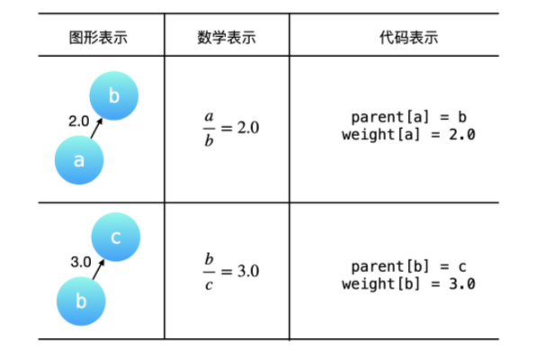
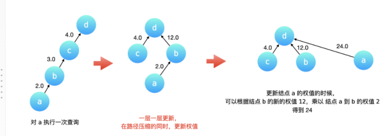
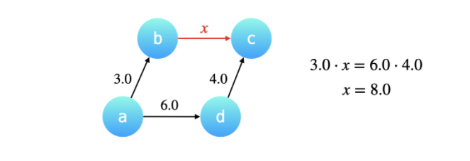

# [冗余连接](https://leetcode-cn.com/problems/redundant-connection)

日期：1月13日 中等

## 描述

在本问题中, 树指的是一个连通且无环的无向图。

输入一个图，该图由一个有着N个节点 (节点值不重复1, 2, ..., N) 的树及一条附加的边构成。附加的边的两个顶点包含在1到N中间，这条附加的边不属于树中已存在的边。

结果图是一个以边组成的二维数组。每一个边的元素是一对[u, v] ，满足 u < v，表示连接顶点u 和v的无向图的边。

返回一条可以删去的边，使得结果图是一个有着N个节点的树。如果有多个答案，则返回二维数组中最后出现的边。答案边 [u, v] 应满足相同的格式 u < v。

```
示例 1：

输入: [[1,2], [1,3], [2,3]]
输出: [2,3]
解释: 给定的无向图为:
  1
 / \
2 - 3
```

## 解法——并查集

题目的意思是不能让最后的树包含环，那么可以使用并查集，如果正在操作的边的两个节点在添加到连通集合之前就已经连通了，说明现在这条边就是冗余的，会使现在的树含有环，返回这条边即可

时间复杂度O(N*α*(*N*)), 空间复杂度O(N)

### 代码

1ms 87.99% 38.7MB 56.00%

```java
class Solution {
    public int[] findRedundantConnection(int[][] edges) {
        int n= edges.length;
        UnionFind unionFind = new UnionFind(n+1);
        for(int i=0;i<n;i++){
            int edge1 = edges[i][0];
            int edge2 = edges[i][1];
            if(unionFind.isConnected(edge1,edge2)){
                return edges[i];
            }else{
                unionFind.union(edge1,edge2);
            }   
        }
        return new int[]{-1,-1};
    }
}
class UnionFind{
    private int[] parent;
    public UnionFind(int n){
        parent = new int[n];
        for(int i=0;i<n;i++){
            parent[i] = i;
        }
    }
    public void union(int x,int y){
        int rootx = find(x);
        int rooty = find(y);
        if(rootx==rooty){
            return;
        }
        parent[rootx] = rooty;
    }
    public int find(int x){
        if(x!=parent[x]){
            parent[x] = find(parent[x]);
        }
        return parent[x];
    }
    public boolean isConnected(int x, int y){
        int rootx = find(x);
        int rooty = find(y);
        if(rootx==rooty){
            return true;
        }else{
            return false;
        }
    }

}
```


# [交换字符串中的元素](https://leetcode-cn.com/problems/smallest-string-with-swaps)

日期：1月11日 难度：中等

## 描述

给你一个字符串 s，以及该字符串中的一些「索引对」数组 pairs，其中 pairs[i] = [a, b] 表示字符串中的两个索引（编号从 0 开始）。

你可以 任意多次交换 在 pairs 中任意一对索引处的字符。

返回在经过若干次交换后，s 可以变成的按字典序最小的字符串。

 ```
示例 1:

输入：s = "dcab", pairs = [[0,3],[1,2]]
输出："bacd"
解释： 
交换 s[0] 和 s[3], s = "bcad"
交换 s[1] 和 s[2], s = "bacd"
 ```

## 解法——并查集

[参考题解](https://leetcode-cn.com/problems/smallest-string-with-swaps/solution/1202-jiao-huan-zi-fu-chuan-zhong-de-yuan-wgab/)

首先字典序：**ASCII 值越小的字符位于字符串中的位置越靠前**，**整个字符串的字典序就越靠前**。

这道题主要需要发现交换的传递性

理解「交换关系具有传递性」：

```
[0, 3] 和 [0, 2] 有共同索引 0 ，说明索引 0、2、3 可以任意交换；
[1, 2] 和 [0, 2] 有共同索引 2 ，说明索引 0、1、2 可以任意交换； 因此 [0, 2] 把 [0, 3] 和 [1, 2] 中出现的索引 0、1、2、3 连在了一起。
```

因此可以使用并查集。

首先，将pairs中的一对加入并查集，构建连通关系，然后构建哈希表，key是并查集每个连通的root，value是一个优先队列：是每个连通的所有元素的排列，最后从哈希表中取出所有元素，拼接出新的字符串

时间复杂度：首先用了路径压缩的并查集，find函数的时间复杂度为Ackermann 函数的反函数，其他时间复杂度按照遍历分析就可以

### 代码

```java
class Solution {
    public String smallestStringWithSwaps(String s, List<List<Integer>> pairs) {
        //如果pairs为空，直接返回s
		if(pairs.size()==0){
			return s;
		}
		int n = s.length();
		UnionFind unionFind = new UnionFind(n);
		for(List<Integer> pair:pairs){
			unionFind.union(pair.get(0),pair.get(1)); //将pairs中的一对连通
		}
		// 建立映射关系
		char[] charArray = s.toCharArray();
		Map<Integer, PriorityQueue<Character>> hashmap = new HashMap<>();
		for(int i=0;i<n;i++){
			int root = unionFind.find(i);
			if(hashmap.containsKey(root)){
				hashmap.get(root).offer(charArray[i]);
			}else{
				PriorityQueue<Character> minHeap = new PriorityQueue<>();
				minHeap.offer(charArray[i]);
				hashmap.put(root,minHeap);
			}
		}
		// 重组字符串
		StringBuilder stringBuilder = new StringBuilder();
		for(int i=0;i<n;i++){
			int root = unionFind.find(i);
			stringBuilder.append(hashmap.get(root).poll());
		}
		return stringBuilder.toString();

    }
}
class UnionFind{
	private int[] parent;
	private int size; //连通数量
	public UnionFind(int n){
		parent = new int[n];
		for(int i=0;i<n;i++){
			parent[i] = i;
		}
		size = n;
	}
	public void union(int x,int y){
		int rootx = find(x);
		int rooty = find(y);
		if(rootx==rooty){
			return;
		}
		parent[rootx] = rooty;
		size--;
	}
	public int find(int x){
		if(x!=parent[x]){
			parent[x] = find(parent[x]);
		}
		return parent[x];
	}
	public Boolean isConnected(int x,int y){
		int rootx = find(x);
		int rooty = find(y);
		if(rootx==rooty){
			return true;
		}else{
			return false;
		}
	}
	public int getSize(){
		return size;
	}
}
```


# [汇总区间](https://leetcode-cn.com/problems/summary-ranges)

日期：1月9日 难度：简单

## 描述

给定一个无重复元素的有序整数数组 nums 。

返回 恰好覆盖数组中所有数字 的 最小有序 区间范围列表。也就是说，nums 的每个元素都恰好被某个区间范围所覆盖，并且不存在属于某个范围但不属于 nums 的数字 x 。

列表中的每个区间范围 [a,b] 应该按如下格式输出：

"a->b" ，如果 a != b
"a" ，如果 a == b


示例 1：

```
输入：nums = [0,1,2,4,5,7]
输出：["0->2","4->5","7"]
解释：区间范围是：
[0,2] --> "0->2"
[4,5] --> "4->5"
[7,7] --> "7"
```

## 自己的思路

通过判断下一个数和当前数是否差一来决定是否属于这个区间
时间复杂度O(n)空间复杂度O(1)

### 代码

8ms 70% 36.6mb 90%

```java
int n=nums.length;
List<String> ret = new ArrayList<>();
if(n==0){
    return ret;
}
if(n==1){
    ret.add(nums[0]+"");
}
int start=nums[0];
for(int i=0;i<n-1;i++){
    if(nums[i+1]>nums[i]+1){
        if(start==nums[i]){
            //区间只有一个数
            ret.add(start+"");
        }else{
            ret.add(start+"->"+nums[i]);
        }
        start = nums[i+1];
    }
}
//已经更新了的话 start=nums[i+1] 
if(start==nums[n-1]){
    ret.add(nums[n-1]+"");

}
else{
    ret.add(start+"->"+nums[n-1]);
}
return ret;
```


# [旋转数组](https://leetcode-cn.com/problems/rotate-array/)

日期：1月8日 难度：中等

## 描述

给定一个数组，将数组中的元素向右移动 k 个位置，其中 k 是非负数。

示例 1:

```
输入: [1,2,3,4,5,6,7] 和 k = 3
输出: [5,6,7,1,2,3,4]
解释:
向右旋转 1 步: [7,1,2,3,4,5,6]
向右旋转 2 步: [6,7,1,2,3,4,5]
向右旋转 3 步: [5,6,7,1,2,3,4]
```

## 自己的思路

### 方法1--复制数组

复制一个数组 新的索引= (旧索引+k)/length 空间复杂度O(n)，时间复杂度O（n）

代码略

### 方法2

一步一步的挪，挪一步只需要记住一个数的值，空间复杂度O(1),时间复杂度kn 

耗时238ms 23.70%

#### 代码

```java
public void rotate(int[] nums, int k) {
		int temp;
		int n = nums.length;
		for(int i=0;i<k;i++){
		temp = nums[n-1];
		for(int j=n-1;j>0;j--){
		 		nums[j] = nums[j-1];
		 	}
		 	nums[0] = temp;
		 }
    }
```

### 方法3--多次反转

先全部反转，例如1234567-> 7654321 ,k=3 ，然后反转前k%n个 ，5674321,再反转剩下的 5671234 每个会被反转2次，时间复杂度n 空间复杂度1 

需要注意：

-  （end-start+1）/2是int 还是double 
- 需要注意 k的范围 

耗时0ms 100% 38.79% 

#### 代码

```java
class Solution {
    public void rotate(int[] nums, int k) {    
		int n = nums.length;
		reverse(nums,0,n-1);
		reverse(nums,0,k%n-1);
		reverse(nums,k%n,n-1); 
       
    }
    public void reverse(int[] nums,int start,int end){
        if(start>=end){
            return;
        }
		//反转数组 空间复杂度1
		for(int i=0;i<(end-start+1)/2;i++){
			int temp = nums[start+i] ;
			nums[start+i] = nums[end-i];
			nums[end-i] = temp;
		}
	}
}
```

### 方法4--最大公约数

[参考题解](https://leetcode-cn.com/problems/rotate-array/solution/xuan-zhuan-shu-zu-by-leetcode-solution-nipk/)

从第一个数开始挪，挪到哪，就记住哪的值，然后开始移动这个位置的数，但这个方法有个问题，有可能挪的位置会构成循环，观察何时会构成循环：

对于一个长度为 n 的数组，整体移动 k 个位置

- 当 n 和 k 的最大公约数 等于 1 的时候：1 次遍历就可以完成交换；比如 n = 5, k = 3
- 当 n 和 k 的最大公约数 不等于 1 的时候：1 次遍历是无法完成的所有元素归位，需要 m (最大公约数) 次

每一轮循环只会在自己的那一组上不停的遍历。所以
**数组的前 m 个元素，其实就是每一个分组的第一个元素，我们控制流程在每次发现一轮循环走到原点时+1**

[参考题解](https://leetcode-cn.com/problems/rotate-array/solution/xuan-zhuan-shu-zu-yuan-di-huan-wei-xiang-xi-tu-jie/)

可以使用一个临时变量 记住构成循环的第一个数的索引，当再次移动到该位置时，就开始下一个循环.

也可以不使用官方题解的最大公约数算法，求循环次数，可以简单地记住已经遍历多少个数了，遍历n个数就结束。

时间复杂度O(n),空间复杂度O(1)

#### 代码

```java
class Solution {
    public void rotate(int[] nums, int k) {
        int n = nums.length;
        k = k % n;
        int count = gcd(k, n);
        for (int start = 0; start < count; ++start) {
            int current = start;
            int prev = nums[start];
            do {
                int next = (current + k) % n;
                int temp = nums[next];
                nums[next] = prev;
                prev = temp;
                current = next;
            } while (start != current);
        }
    }

    public int gcd(int x, int y) {
        return y > 0 ? gcd(y, x % y) : x;
    }
}


```


# [省份数量](https://leetcode-cn.com/problems/number-of-provinces/)

日期：1月7日 难度：中等

## 描述

有 n 个城市，其中一些彼此相连，另一些没有相连。如果城市 a 与城市 b 直接相连，且城市 b 与城市 c 直接相连，那么城市 a 与城市 c 间接相连。

省份 是一组直接或间接相连的城市，组内不含其他没有相连的城市。

给你一个 n x n 的矩阵 isConnected ，其中 isConnected[i][j] = 1 表示第 i 个城市和第 j 个城市直接相连，而 isConnected[i][j] = 0 表示二者不直接相连。

返回矩阵中 省份 的数量

示例：

```
输入：isConnected = [[1,1,0],[1,1,0],[0,0,1]]
输出：2
```

## 自己的思路

这是一道很明显的并查集应用，因为具有传递性和连通性。直接套模板就好，在遍历时可以只遍历上三角。时间复杂度O(n^2log(n))n是城市个数，空间复杂度O(n)

### 代码

```java
class Solution {
    public int findCircleNum(int[][] isConnected) {
        int n = isConnected.length;
		UnionFind unionFind = new UnionFind(n);
		for(int i=0;i<n;i++){
			for(int j=i+1;j<n;j++){
				if(isConnected[i][j]==1){
                    
					unionFind.union(i,j);
                   
				}
			}
		}
		return unionFind.getSize();

    }
    class UnionFind{
	private int[] parent;
	private int size;
	public UnionFind(int n){
		this.parent = new int[n];
		this.size = n;
        for(int i=0;i<n;i++){
			this.parent[i] = i;
		}
	}
	public void union(int x,int y){
		int rootx = find(x);
		int rooty = find(y);
		if(rootx==rooty){
			return;
		}
        
		parent[rootx] = rooty;
		size--;

	}
	public int find(int x){
		if(x!=parent[x]){
			int origin = parent[x];
			parent[x] = find(parent[x]);
		}
		return parent[x];
	}
	public Boolean isConnected(int x, int y){
		int rootx = find(x);
		int rooty = find(y);
		if(rootx==rooty){
			return true;
		}else{
			return false;
		}

	}
	public int getSize(){
		return size;
	}
}
}
```


# [除法求值](https://leetcode-cn.com/problems/evaluate-division)

日期：1月6日 难度：中等

## 描述

给你一个变量对数组 equations 和一个实数值数组 values 作为已知条件，其中 equations[i] = [Ai, Bi] 和 values[i] 共同表示等式 Ai / Bi = values[i] 。每个 Ai 或 Bi 是一个表示单个变量的字符串。

另有一些以数组 queries 表示的问题，其中 queries[j] = [Cj, Dj] 表示第 j 个问题，请你根据已知条件找出 Cj / Dj = ? 的结果作为答案。

返回 所有问题的答案 。如果存在某个无法确定的答案，则用 -1.0 替代这个答案。

注意：输入总是有效的。你可以假设除法运算中不会出现除数为 0 的情况，且不存在任何矛盾的结果。

示例 1：

输入：equations = [["a","b"],["b","c"]], values = [2.0,3.0], queries = [["a","c"],["b","a"],["a","e"],["a","a"],["x","x"]]
输出：[6.00000,0.50000,-1.00000,1.00000,-1.00000]
解释：
条件：a / b = 2.0, b / c = 3.0
问题：a / c = ?, b / a = ?, a / e = ?, a / a = ?, x / x = ?
结果：[6.0, 0.5, -1.0, 1.0, -1.0 ]

提示：

- 1 <= equations.length <= 20
- equations[i].length == 2
- 1 <= Ai.length, Bi.length <= 5
- values.length == equations.length
- 0.0 < values[i] <= 20.0
- 1 <= queries.length <= 20
- queries[i].length == 2
- 1 <= Cj.length, Dj.length <= 5
- Ai, Bi, Cj, Dj 由小写英文字母与数字组成

## 自己的思路

一开始把题目想的太简单：

觉得用哈希表存储池字符和对应的数值就基本差不多了：1. 如果被除数已知，那么除数=被除数/结果 2. 如果除数已知，那么被除数=结果x除数3. 如果两个都未知，除数就=1.0 被除数=value[i]
求解规则：1. 如果两个均已知，就直接求 2. 如果两个有一个未知，就=-1.0

但这种方法忽略了这种情况：已知a/b,e/f,a/e，是可以求解去abef的，f不一定等于1

## 解法--并查集

处理有传递性关系的问题，可以使用「并查集」，对于本道题：

- 将题目给出的 equation 中的两个变量连通

- 如果两个变量不在同一个连通集中， 返回 -1.0。并且根据题目的意思，如果两个变量中 至少有一个 变量没有出现在所有 equations 出现的字符集合中，也返回 -1.0。

### 构建有向图

由于分子分母不可调换，因此该图是有向图，由于有value，所有有权重，权重即为value



如何计算同一个连通集的元素之间的比值？



从一个节点出发，指向另一个节点的所有路径的乘积应该是相同的。利用这个，可以求连通集元素之间的比值，也可以实现执行find函数时，进行路径压缩，改变节点指向时修改有向边权重的计算。也可以完成合并两个连通集时的有向边权重，例如已知a/b d/c 又知a/d 那么其实需要将b和c相连，需要计算b和c有向边的权重



### 路径压缩

使用递归的路径压缩可以保证，每个节点直接连向根节点

### 复杂度

时间复杂度：O((N+Q)logA)，

构建并查集 O(NlogA) ，这里 N 为输入方程 equations 的长度，每一次执行合并操作的时间复杂度是 O(logA)，这里 A 是 equations 里不同字符的个数；
查询并查集O(QlogA)，这里 Q 为查询数组 queries 的长度，每一次查询时执行「路径压缩」的时间复杂度是 O(logA)。
空间复杂度：O(A)：创建字符与 id 的对应关系 hashMap 长度为 A，并查集底层使用的两个数组 parent 和 weight 存储每个变量的连通分量信息，parent 和 weight 的长度均为 A

### 思考

使用之前的路径压缩的代码（非递归：parent[x] = parent[parent[x]];）一次find无法保证每个节点的父节点都变成根节点，但是使用递归的find可以保证。

此题无需优化：union时将小树的父节点置为大树的根节点，如果进行该优化，需要注意有向边的权重的计算公式跟将大树连在小树上是不同的。

### 代码

```java
public class Solution {

    public double[] calcEquation(List<List<String>> equations, double[] values, List<List<String>> queries) {
    	int equationsSize = equations.size();
    	UnionFind unionFind = new UnionFind(2*equationsSize);
    	//将变量的值与id进行映射
    	Map<String,Integer> hashmap = new HashMap<>(2 * equationsSize);
    	int id = 0;
    	for(int i=0;i<equationsSize;i++){
    		List<String> equation = equations.get(i); //每个等式
    		String var1 = equation.get(0);
    		String var2 = equation.get(1);
    		if(!hashmap.containsKey(var1)){
    			hashmap.put(var1,id);
    			id++;
    		}
    		if(!hashmap.containsKey(var2)){
    			hashmap.put(var2,id);
    			id++;
    		}
    		unionFind.Union(hashmap.get(var1),hashmap.get(var2),values[i]);
    	}
    	//查询
    	int queriesSize = queries.size();
    	double[] ret = new double[queriesSize];
    	for(int i=0;i<queriesSize;i++){
    		List<String> query = queries.get(i);
    		String var1 =query.get(0);
    		String var2 = query.get(1);
    		if(!hashmap.containsKey(var1) || !hashmap.containsKey(var2)){
    			ret[i] = -1.0d;
    		}else{
    			ret[i] = unionFind.isConnected(hashmap.get(var1),hashmap.get(var2));
    		}
    		
    	}
    	return ret;
    }
}
class UnionFind{
	private int[] parent; //需要是int类型，因为节点需要充当数组下标，例如需要利用parent[x]=x
	private double[] weight; //指向父节点的权值

	public UnionFind(int n){
		this.parent = new int[n];
		this.weight = new double[n];
		for(int i=0;i<n;i++){
			parent[i] = i; //初始父节点是自己
			weight[i] = 1.0d; //初始有向边的权值为1
		}
	}
	public void Union(int p,int q,double value){
		int rootp = find(p);
		int rootq = find(q);
		if(rootp==rootq){
			return;
		}
		parent[rootp] = rootq;
		weight[rootp] = value*weight[q]/weight[p];  //这个的前提是p q 都直接连接在根节点上
	}
	public int find(int p){
		if(p!=parent[p]){
			int origin = parent[p];
			parent[p] = find(parent[p]);
			weight[p] *= weight[origin];
		}
		return parent[p];
	}
	public double isConnected(int p,int q){
		int rootp = find(p);
		int rootq = find(q);
		if(rootp==rootq){
			return weight[p]/weight[q];
		}else{
			return -1.0d;
		}
	}
}

```

[参考题解1](https://leetcode-cn.com/problems/evaluate-division/solution/399-chu-fa-qiu-zhi-nan-du-zhong-deng-286-w45d/)

## 知识点

​    1. 保存位数：Math.round(x*1000)/1000.000 n是保留的位数，1000=10^n

​    2. java默认是double

​    3. java中数组求长度是length属性，String求长度是方法length()，集合求长度是size()

​    4. 集合获取元素是get方法，数组可以直接用[]

